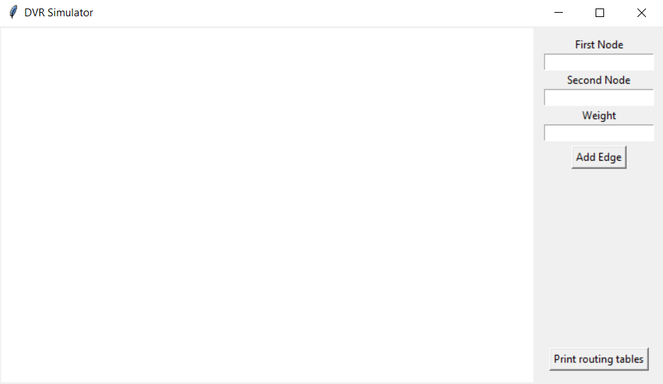

# Documentazione del progetto
#### Documentazione relativa al progetto di Reti di Telecomunicazioni sulla simulazione di un protocollo di routing in Python.
**Autore**: Francesco Tonelli, Matricola 0001071531

## Indice
1. [Introduzione](#introduzione)
2. [Requisiti](#requisiti)
3. [Avvio](#avvio)
4. [Utilizzo](#utilizzo)
5. [Struttura del Codice](#struttura-del-codice)

## Introduzione
La traccia del progetto indicava di sviluppare la simulazione di un protocollo di routing semplice.  
Ho optato per il protocollo di Distance Vector Routing, il quale però presenta limitazioni in caso di guasti nei collegamenti o nei nodi, poiché gli aggiornamenti delle routing table possono risultare errati in tali circostanze.  
Per superare questo limite, ho modificato l'algoritmo rendendolo più adattivo, così da garantire la continuità e la correttezza degli aggiornamenti anche in seguito ad una qualsiasi rimozione di un elemento della rete.  
Infine, ho implementato un'interfaccia grafica interattiva per permettere agli utenti di testare l'algoritmo su una rete personalizzata.

## Requisiti
- <b>Windows</b>: Python 3.9 o superiore
- <b>Linux/iOS</b>: Python 3.9
- <b>Connessione Internet</b>: al primo avvio, se non già presenti, dovranno essere scaricate le librerie *tkinter* (che mette a disposizione funzioni per creare interfacce grafiche) e *tabulate* (che genera tabelle testuali leggibili, utilizzate nella stampa delle routing tables dei nodi). Questo download viene eseguito automaticamente dagli script forniti per l'esecuzione del progetto, che necessiteranno, quindi, di una connessione ad internet.

## Avvio
<b>Windows</b>: fare doppio click sul file *start.bat* o, da linea di comando sulla root del progetto, lanciare `.\start.bat`  
<b>Linux/iOS</b>: aprire il terminale sulla root del progetto, digitare il comando `chmod 777 start.sh` e premere *Invio*, per abilitare l'esecuzione dello script. Successivamente, fare doppio click sul file *start.sh* o, da linea di comando, sempre sulla root, lanciare `./start.sh`

### Cosa succede all'avvio?
1. Entrambi gli script tenteranno, innanzitutto, di installare o aggiornare <b>pip</b>, per garantire i successivi download.
2. Se non già presenti, gli script scaricheranno, o aggiorneranno, le librerie necessarie sopracitate.
3. Se tutte le installazioni saranno andate a buon fine, l'applicazione verrà avviata.

## Utilizzo
All'avvio, l'applicazione si presenta come in figura, con una schermata bianca sulla sinistra e un menu sulla destra.

Tramite questa interfaccia, è possibile:

- <b>Aggiungere un nodo</b> cliccando con il pulsante sinistro in un qualsiasi punto della schermata bianca. I nodi saranno inizializzati con un identificatore incrementale: il primo creato sarà il numero 1, il secondo il 2, e così via.  
<u>Nota</u>: l'identificativo di un nodo eliminato non viene riutilizzato per creare altri nodi.
- <b>Aggiungere un arco</b> compilando i tre campi nel menu a destra, inserendo gli identificativi dei due nodi interessati e il peso dell'arco, e premendo il pulsante "Add Edge".  
<u>Nota</u>: ogni arco è bidirezionale, non può avere ad entrambi gli estremi lo stesso nodo e non può esistere più di un arco fra i medesimi due nodi.
- <b>Eliminare un elemento</b> cliccando con il tasto destro vicino allo stesso. Verrà selezionato il nodo o l'arco che si trova più vicino al punto in cui si è cliccato. Si aprirà una finestra di dialogo, in cui si chiede conferma della cancellazione, e, in caso di risposta affermativa a quest'ultima, verrà cancellato l'elemento selezionato.
- <b>Stampare le routing tables dei nodi</b> tramite l'apposito pulsante in basso a destra. Verrà generato (o sovrascritto, se già presente) il file *RoutingTables.txt* nella root del progetto, il quale conterrà la routing table di ogni nodo e l'elenco degli archi fisici presenti nella rete, in formato testuale.

All'avvio dell'applicazione, inoltre, viene generato il file *log.txt* (contenente un log dettagliato di ogni evento), sempre nella root del progetto, che viene aggiornato ad ogni azione e ad ogni update dei nodi, per fornire un quadro più dettagliato di cosa sta succedendo durante l'esecuzione.

## Struttura del Codice
Il progetto si divide in due file, uno che gestisce la logica e uno che si occupa della grafica. Il codice è strutturato in maniera tale che le funzioni e le classi del primo script vengano sfruttati dal secondo per garantire le modifiche alla rete e l'aggiornamento delle routing tables, simulando quanto più fedelmente possibile il comportamento di un sistema reale.  
Vengono in seguito descritte le classi e le funzioni che compongono questi due file, e come queste interagiscono fra di loro.

## DVR_logic

<b>class RoutingMapEntry </b>  
Utilizzata dalle routing tables dei nodi, le quali sono gestite come delle dictionary che associano l'id del nodo di una destinazione ad un istanza di questa classe.

- <u>Attributi:</u>  
  - `dist: int`: la distanza alla destinazione
  - `nextHop: int`: l'id del prossimo nodo da attraversare.

---

<b>class EdgeMapEntry </b>   
Utilizzata da *__edgeMap* della classe *EdgesMap* per memorizzare gli archi nella rete. Questa è gestita come una dictionary che associa l'id di un nodo ad una lista di istanze di questa classe.

- <u>Attributi:</u>  
  - `dst: int`: l'id del nodo all'altro estremo dell'arco.
  - `w: int`: il peso dell'arco.

---

<b>class WebNode </b>   
Rappresenta un nodo nella rete.

- <u>Attributi:</u>  
  - `__id: int`: l'identificativo del nodo.
  - `__routingMap: dict[int, RoutingMapEntry]`: la routing table del nodo.

- <u>Metodi:</u>  
  - `getId(self) -> int`: restituisce l'id del nodo.
  - `getRoutingMap(self) -> dict[int, RoutingMapEntry]`: restituisce una copia della routing table del nodo. 
  - `__str__(self)`: override che, utilizzando la libreria *tabulate*, genera una rappresentazione testuale sotto forma di tabella della routing map del nodo, e la restituisce come stringa.
  - `updateRoutes(self, senderId: int, routingMap: dict[int, RoutingMapEntry], phisical:list[EdgeMapEntry]) -> bool`: forma modificata rispetto all'originale Distance Vector Routing, per garantire aggiornamenti corretti anche nel caso di guasti all'interno della rete. Il nodo interessato, nell'ordine:
    1. Aggiunge il mittente alla propria routing table (se questo non è già presente, o è raggiungibile tramite percorsi più costosi), sfruttando un eventuale cammino diretto (quindi con next hop uguale alla destinazione), potenzialmente memorizzato dal sender, diretto verso di sè. Se il mittente non viene ancora aggiunto nella routing table del nodo in questione, non si procede oltre.
    2. Depreca tutti i percorsi, nella sua routing table, che hanno coem next hop il mittente, ma che non sono più raggiungibili passando per quest'ultimo.
    3. Per ogni cammino deprecato, simula un ping, leggendo ad hoc gli archi a lui connessi e cercando, se possibile, percorsi diretti ancora validi da attraversare. Non richiede altre routing table, controlla semplicemente se un nodo, che prima raggiungeva indirettamente, sia un suo vicino.
    4. Come nell'algoritmo originale, basandosi sulla routing table del mittente, aggiorna o aggiunge percorsi peggiori di quelli proposti o fino ad ora sconosciuti.
  - `readRoutes(self, edges: list[EdgeMapEntry])`: simula eventuali ping che un nodo invia ai suoi vicini per conoscerne le distanze, agli effetti permette al nodo di leggere gli archi ai quali è collegato. Il nodo, nell'ordine:
    1. Controlla se ci sono cammini nella routing table che non sono più percorribili, quindi se il nextHop non è più fisicamente raggiungibile, e depreca queste route.
    2. Se un cammino deprecato è raggiungibile direttamente attraverso un arco, lo aggiorna nella routing table.
    3. Se risultano, tra i collegamenti fisici, cammini migliori o non conosciuti nella propria routing table, li aggiorna.

---

<b>class EdgesMap </b>   
Memorizza gli archi e i nodi nella rete, e fornisce le funzioni per modificare quest'ultima o sincronizzare gli aggiornamenti.

- <u>Attributi:</u>  
  - `__edgeMap: dict[int, list[EdgeMapEntry]]`: la mappa di tutti gli archi.

- <u>Metodi:</u>  
  - `__str__(self)`: override che traduce in stringa la mappa degli archi (prendendone solo uno, nel caso di stessi nodi invertiti di posto) e la restituisce.
  - `getMap(self) -> dict[int, list[EdgeMapEntry]]`: restituisce la mappa degli archi.
  - `doExistsNode(self, nodeId: int) -> bool`: controlla se un nodo con l'id indicato esiste nella rete.
  - `doExistsEdge(self, srcId: int, dstId: int) -> bool`: controlla se tra due nodi esiste un arco.
  - `addEdge(self, srcId: int, dstId: int, weight: int, NodeList: list[WebNode])`: se entrambi i nodi indicati come estremi esistono, inserisce in *__edgeMap* un arco che porta da *srcId* a *dstId* e il suo complementare, se questi non esistono già. Utilizzando la funzione `makeNodesReadNet`, comanda ai due nodi interessati di leggere i loro archi, simulando l'azione dei nodi che si accorgono di un cambiamento nella rete.
  - `removeEdge(self, srcId: int, dstId: int, NodeList: list[WebNode])`: cancella i due archi complementari (se esistono) che connettono *srcId* e *nodeId*, e comanda ai due nodi interessati di leggere i loro archi, simulando l'azione dei nodi che si accorgono di un cambiamento nella rete.
  - `addNode(self, nodeId: int) -> WebNode`: aggiunge un nodo a *__edgeMap* (lo inserisce come chiave con associata una lista vuota), se non è già presente uno con lo stesso id, e restituisce un oggetto *WebNode* che identifica l'elemento. Se esiste già, restituisce `None`.
  - `removeNode(self, nodeId: int, NodeList: list[WebNode])`: Se il nodo esiste, elimina il suo record da *__edgeMap*, rimuove anche tutti gli archi che lo indicavano come una delle due estremità, e comanda ai nodi che erano a lui contigui (estratti con `getNeighborsId`) di leggere i loro archi, simulando l'azione dei nodi che si accorgono di un cambiamento nella rete.
  - `getEdges(self, nodeId: int) -> list[EdgeMapEntry]`: ritorna la lista degli archi connessi ad un certo nodo.
  - `getNeighborsId(self, nodeId: int) -> list[int]`: restituisce la lista dei nodi contigui a quello con id indicato.

---

<b>Funzioni esterne</b>

- `findNodePos(id: int, NodeList: list[WebNode]) -> int`: trova la posizione del nodo con id indicato all'interno della NodeList.
- `makeNodesReadNet(nodesId: list[int], NetManager: EdgesMap, NodeList: list[WebNode])`: simula il ping di un nodo verso i propri vicini, leggendo gli archi a lui connessi.
- `updateNet(NodeList: list[WebNode], NetManager: EdgesMap, priorityNodesId:list[int])`: simula il comportamento di una rete di nodi nel momento di un aggiornamento delle routing table. I nodi specificati nella lista *priorityNodesId* sono solitamente quelli che hanno assistito direttamente ad un cambiamento nella rete, e invieranno la propria routing table ai loro vicini, i quali ripeteranno questo comportamento ricorsivamente. Il processo si ripete fin quando la rete non si stabilizza.
- `actionLog(message: str)`: usato da alcune delle funzioni sopraelencate per segnalare un'azione sul file *log.txt*
- `messageLog(message: str)`: usato da alcune delle funzioni sopraelencate per scrivere un messaggio sul file *log.txt*

## DVR_view

<b>class VisualObject </b>   
Utilizzata da GraphGUI nelle dictionary *nodeVisuals* e *edgeVisuals* per associare all'id di un nodo o di un arco tutti i parametri relativi alla loro visualizzazione sul canvas dell'interfaccia, in maniera tale da averli disponibili al momento della cancellazione o per eventuali modifiche future. 

- <u>Attributi:</u>  
  - `shape: int`: l'identificativo della forma che rappresenta l'elemento, creata dalla libreria *tkinter* (un cerchio per i nodi, una linea per gli archi). 
  - `text: int`: l'identificativo della testo associato, creato sempre dalla libreria *tkinter* (l'identificativo per i nodi, il peso per gli archi).
  - `x: float`: la coordinata x della loro posizione sul canvas.
  - `y: float`: la coordinata x della loro posizione sul canvas. 
  Per un arco, queste coordinate indicano il suo punto medio.
  

--- 

<b>class GraphGUI </b> 
Questa è la classe che gestisce il comparto grafico, e richiama all'occorrenza i metodi di *DVR_logic* per l'aggiornamento concettuale della rete e delle tabelle.

- <u>Attributi:</u>  
  - `root: tk.Tk`: la root della GUI di *tkinter*.
  - `idCounter: int`: il contatore incrementale usato per assegnare l'id ai nodi creati.
  - `NodeList: list[DVR_logic.WebNode]`: la lista di oggetti *DVR_logic.WebNode* relativi ai nodi nella rete. 
  - `NetManager: DVR_logic.EdgesMap`: l'oggetto che contiene la rappresentazione fisica delle connessioni e i metodi che gestiscono gli aggiornamenti nella rete, come le aggiunte, le rimozioni e i controlli.
  - `nodeVisuals: dict[int, VisualObject]`: la dictionary che associa all'id di un nodo gli attributi della sua rappresentazione sul canvas.
  - `edgeVisuals: dict[tuple[int, int], VisualObject]`: la dictionary che associa all'id di un edge gli attributi della sua rappresentazione sul canvas.

- <u>Metodi:</u>
  - `createNode(self, event)`: genera un nuovo *WebNode* utilizzando la funzione `addNode` di *NetManager* con il valore incrementale di *idCounter* e, se questo è possibile, lo aggiunge alla *NodeList* e genera la sua rappresentazione grafica sul canvas, nel punto in cui è stato effettuato il click.
  - `addEdge(self)`: verifica i valori dei due nodi e del peso inseriti e, se sono validi (sono valori interi, non viene indicato lo stesso nodo, non viene indicato un nodo inesistente, l'arco è già presente), crea la sua rappresentazione grafica, e usa *NetManager* per segnalare l'aggiunta di un arco, e la funzione `updateNet` di *DVR_logic* per far aggiornare le routing tables dei nodi.
  - `findClosestItem(self, event) -> tuple[int, int]`: in base alla posizione del click del mouse che gli viene passata, cerca quali sono il nodo e l'arco più vicini sul canvas, e restituisce `(nodeId, None)` se l'elemento più vicino è un nodo, `(srcId, dstId)` se è un arco, oppure `(None, None)` se non c'è nessun elemento.
  - `handleRightClick(self, event)` : utilizza `findClosestItem` per identificare l'elemento più vicino alla posizione del click, e in base al ritorno lancia `deleteNode` oppure `deleteEdge` (se `findClosestItem` non trova nessun elemento, non succede nulla). 
  - `deleteNode(self, id: int)`: chiede conferma all'utente per l'eliminazione e, se riceve conferma, cancella la visualizzazione del nodo indicato e degli archi ad esso associati, dopodichè usa `removeNode` di NetManager per effettuare la cancellazione a livello logico, e richiama la funzione `updateNet` di *DVR_logic* per far aggiornare le routing tables dei nodi
  - `deleteEdge(self, edgeIds: tuple[int, int])`: chiede conferma all'utente per l'eliminazione e, se riceve conferma, cancella la visualizzazione dell'arco indicato, dopodichè usa `removeEdge` di NetManager per effettuare la cancellazione a livello logico, e richiama la funzione `updateNet` di *DVR_logic* per far aggiornare le routing tables dei nodi
  - `printRoutingTables(self)`: crea o sovrascrive il file *RoutingTables.txt*, per poi stampare su di quest'ultimo le routing tables di tutti i nodi e la rappresentazione degli archi nella rete.
